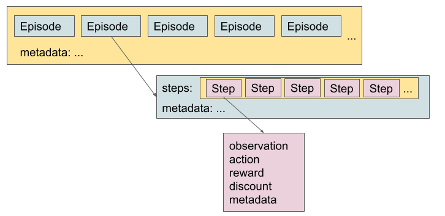

# RLDS

RLDS stands for Reinforcement Learning Datasets and it is an ecosystem of tools
to store, retrieve and manipulate episodic data in the context of Sequential
Decision Making including Reinforcement Learning (RL), Learning for
Demonstrations, Offline RL or Imitation Learning.

This repository includes a library for manipulating RLDS compliant datasets. For
other parts of the pipeline please refer to:

*   [EnvLogger](http://github.com/deepmind/envlogger) to create synthetic
    datasets
*   [RLDS Creator](http://github.com/google-research/rlds-creator) to create
    datasets where a human interacts with an environment.
*   [TFDS](http://www.tensorflow.org/datasets/catalog/overview) for existing RL
    datasets.

Learn more about the RLDS ecosystem in the
[Google AI Blog](https://ai.googleblog.com/2021/12/rlds-ecosystem-to-generate-share-and.html)
and the [arXiv paper](https://arxiv.org/abs/2111.02767).

## QuickStart & Colabs

See how to use RLDS in this
[tutorial](https://colab.research.google.com/github/google-research/rlds/blob/main/rlds/examples/rlds_tutorial.ipynb).

You can find more examples in the following colabs:

*   [Performance best practices](https://colab.research.google.com/github/google-research/rlds/blob/main/rlds/examples/rlds_performance.ipynb)
*   [RL examples](https://colab.research.google.com/github/google-research/rlds/blob/main/rlds/examples/rlds_examples.ipynb)
*   [Colab](https://colab.research.google.com/github/google-research/rlds/blob/main/rlds/examples/tfds_rlu_atari.ipynb) for loading uniformly subsampled RLU Atari datasets such as 1%, 5% and 10% Atari datasets, as introduced by [Agarwal et al. (2020)](https://arxiv.org/abs/1907.04543) and commonly used in offline RL research (e.g., CQL, Decision Transformer, MuZero ReAnalyze).

## Available datasets

This is a non-exhaustive list of datasets that are compatible with RLDS:

*   **[D4RL](https://www.tensorflow.org/datasets/catalog/overview#d4rl)**:
    subset of the [D4RL suite](https://github.com/rail-berkeley/d4rl) with
    Mujoco, Adroit and AntMaze tasks.
*   **[RL Unplugged](https://www.tensorflow.org/datasets/catalog/overview#rl_unplugged)**:
    subset of the
    [RL Unplugged suite](https://github.com/deepmind/deepmind-research/tree/master/rl_unplugged)
    that includes DMLab, Atari and Real World RL datasets.
*   **[Robosuite](https://www.tensorflow.org/datasets/catalog/robosuite_panda_pick_place_can)**:
    three [Robosuite](https://robosuite.ai/) datasets generated with the RLDS
    tools.

If you want to add your dataset to this list, let us know!

## Dataset Format

The dataset is retrieved as a `tf.data.Dataset` of Episodes where each episode
contains a `tf.data.Dataset` of steps.



*   **Episode**: dictionary that contains a `tf.data.Dataset` of Steps, and
    metadata.

    The metadeta fields are user-defined. While no names or types are
    prescribed, we propose a set of optional fields that are generic and useful.
    * Metadata optional fields:

      * `episode_id`: Unique identifier of the episode within the dataset.
        The episode ID should also be unique with high probability across
        datasets so different datasets can be merged easily on the fly.
      * `agent_id`: Unique identifier of the agent(s) that generated the
        episode. In a multi-agent setting, this could be for example a tensor
        of size Nx2 where N is the number of agents and where each pair
        represents the agent name in the environment and the ID of the agent
        that actually generated the episode.
      * `environment_config`: Configuration of the environment that was used
        to generate the episode.
      * `experiment_id`: Identifier of an experiment when the episode was
        generated as part of an experiment.
      * `invalid`: Flag to signal invalid episodes, which in general
        should be discarded at read time. Since episodes are in general
        recorded step by step, there are a few scenarios where an episode
        might be incomplete: e.g. machine preemption. This flag is usually
        used in dtaasets that have just been created and not polished for
        sharing.

*   **Step**: dictionary that contains:

    * Mandatory fields:

      *   `is_first`: if this is the first step of an episode that contains the
          initial state.
      *   `is_last`: if this is the last step of an episode, that contains the
          last observation. When true, `action`, `reward` and `discount`, and
          other cutom fields subsequent to the observation are considered invalid.
    * Optional fields:
      *   `observation`: current observation
      *   `action`: action taken in the current observation
      *   `reward`: return after appyling the action to the current observation
      *   `is_terminal`: if this is a terminal step
      *   `discount`: discount factor at this step.
      *   extra metadata

    When `is_terminal = True`, the `observation` corresponds to a final state,
    so `reward`, `discount` and `action` are meaningless. Depending on the
    environment, the final `observation` may also be meaningless.

    If an episode ends in a step where `is_terminal = False`, it means that this
    episode has been truncated. In this case, depending on the environment, the
    action, reward and discount might be empty as well.

    Note: Although some fields of the steps are optional, all the steps in the
    same dataset are required to have the same fields.

## How to create a dataset

Although you can read datasets with the RLDS format even if they were not
created with our tools (for example, by adding them to [TFDS](#load-with-tfds)),
we recommend the use of [EnvLogger] and [RLDS Creator] as they ensure that the
data is stored in a lossless fashion and compatible with RLDS.

### Synthetic datasets

Envlogger provides a [dm_env] `Environment` class wrapper that records
interactions between a real environment and an agent.

```
env = envlogger.EnvLogger(
      environment,
      data_directory=`/tmp/mydataset`)
```

Besides, two callbacks can be passed to the `EnvLogger` constructor to
store per-step metadata and per-episode metadata. See the [EnvLogger]
documentation for more details.

Note that per-session metadata can be stored but is currently ignored when
loading the dataset.

Note that the Envlogger follows the [dm_env] convention. So considering:

*   `o_i`: observation at step `i`
*   `a_i`: action applied to `o_i`
*   `r_i`: reward obtained when applying `a_i` in `o_i`
*   `d_i`: discount for reward `r_i`
*   `m_i`: metadata for step `i`

Data is generated and stored as:

```none
    (o_0, _, _, _, m_0) → (o_1, a_0, r_0, d_0, m_1)  → (o_2, a_1, r_1, d_1, m_2) ⇢ ...
```

But loaded with RLDS as:

```none
    (o_0,a_0, r_0, d_0, m_0) → (o_1, a_1, r_1, d_1, m_1)  → (o_2, a_2, r_2, d_2, m_2) ⇢ ...
```

### Human datasets

If you want to collect data generated by a human interacting with an
environment, check the [RLDS Creator].

## How to load a dataset

RL datasets can be loaded with [TFDS](#load-with-tfds)
and they are retrieved
with the canonical [RLDS dataset format](#dataset-format).

See [this section](#how-to-add-your-dataset-to-tfds) for instructions on how to
add an RLDS dataset to TFDS.

### Load with TFDS

#### Datasets in the TFDS catalog

These datasets can be loaded directly with:

```py
tfds.load('dataset_name').as_dataset()['train']
```

This is how we load the datasets in the
[tutorial](https://colab.research.google.com/github/google-research/rlds/blob/main/rlds/examples/rlds_tutorial.ipynb).

See the full documentation and the catalog in the [TFDS] site.

#### Datasets in your own repository

Datasets can be implemented with TFDS both inside and outside of the TFDS
repository. See examples
[here](https://www.tensorflow.org/datasets/external_tfrecord?hl=en#load_dataset_with_tfds).

## How to add your dataset to TFDS

Adding a dataset to TFDS involves two steps:

*   Implement a python class that provides a dataset builder with the specs of
    the data (e.g., what is the shape of the observations, actions, etc.) and
    how to read your dataset files.

*   Run a `download_and_prepare` pipeline that converts the data to the TFDS
    intermediate format.

You can add your dataset directly to TFDS
following the instructions at https://www.tensorflow.org/datasets.

* If your data has been generated with Envlogger or the RLDS Creator, you can just use the rlds helpers in TFDS (see [here](https://github.com/tensorflow/datasets/blob/master/tensorflow_datasets/rlds/robosuite_panda_pick_place_can/robosuite_panda_pick_place_can.py) an example).
* Otherwise, make sure your `generate_examples` implementation provides the same structure
  and keys as RLDS loaders if you want your dataset to be compatible with RLDS
  pipelines
  ([example](https://github.com/tensorflow/datasets/blob/master/tensorflow_datasets/d4rl/dataset_utils.py)).


Note that you can follow the same steps to add the data to your own repository
(see more details in the [TFDS documentation](https://www.tensorflow.org/datasets/add_dataset?hl=en)).

## Performance best practices

As RLDS exposes RL datasets in a form of Tensorflow's
[tf.data](https://www.tensorflow.org/api_docs/python/tf/data), many Tensorflow's
[performance hints](https://www.tensorflow.org/guide/data_performance#optimize_performance)
apply to RLDS as well. It is important to note, however, that RLDS datasets are
very specific and not all general speed-up methods work out of the box. advices
on improving performance might not result in expected outcome. To get a better
understanding on how to use RLDS datasets effectively we recommend going through
this
[colab](https://colab.research.google.com/github/google-research/rlds/blob/main/rlds/examples/rlds_performance.ipynb).

## FAQ

### Processing steps in random order

While by default the order of episodes in RLDS datasets is randomized and there
is no need to randomize them again when loading the dataset, some algorithms
operate on steps/n-step transitions. There are different ways to interleave
steps across multiple episodes - for example:

* Shuffle steps using [tf.data.Dataset.shuffle](https://www.tensorflow.org/api_docs/python/tf/data/Dataset#shuffle).
Note that obtaining perfect shuffling this way involves specifying `buffer_size`
which can accomodate entire dataset and can result in high memory usage for big datasets.

* Interleave `N` copies of the dataset using [tf.data.Dataset.interleave](https://www.tensorflow.org/api_docs/python/tf/data/Dataset#interleave):

```
def ds_loader():
  episode_dataset = tfds.load(...)
  step_dataset = episode_dataset.flat_map(lambda x: x[rlds.STEPS])
  return step_dataset

dataset = Dataset.range(1, N).interleave(ds_loader, cycle_length=..., block_length=...)
```

Each copy of the dataset shuffles input partitions independently, so consecutive steps
returned by the resulting dataset come from unrelated episodes. It is important to note,
however, that this way each step will be loaded `N` times. To avoid duplicates,
it is possible to construct each dataset using disjoint [splits](https://www.tensorflow.org/datasets/splits).

See one example of randomized access in the [Atari colab](https://colab.research.google.com/github/google-research/rlds/blob/main/rlds/examples/tfds_rlu_atari.ipynb).
### Reducing memory usage

To improve throughput of loading datasets, by default TFDS loads multiple partitions
of the dataset in parallel. In the case of datasets with big episodes that can result
in high memory usage. If you run into high memory usage problems, it is worth playing
around with `read_config` provided to [tfds.load](https://www.tensorflow.org/datasets/api_docs/python/tfds/load).

## Other research that uses RLDS

These are some publications that we know have used the RLDS ecosystem:

*   [Hyperparameter Selection for Imitation Learning](https://arxiv.org/abs/2105.12034).
    L. Hussenot et al., ICML 2021.
*   [Continuous Control with Action Quantization from Demonstrations](https://arxiv.org/pdf/2110.10149.pdf),R.
    Dadashi et al., Deep RL Workshop @NeurIPS 2021.
*   [What Matters for Adversarial Imitation Learning?](https://arxiv.org/pdf/2106.00672.pdf)
    M. Orsini et al., NeurIPS 2021.

## Citation

If you use RLDS, please cite the [RLDS paper](https://arxiv.org/abs/2111.02767)
as

```
@misc{ramos2021rlds,
      title={RLDS: an Ecosystem to Generate, Share and Use Datasets in Reinforcement Learning},
      author={Sabela Ramos and Sertan Girgin and Léonard Hussenot and Damien Vincent and Hanna Yakubovich and Daniel Toyama and Anita Gergely and Piotr Stanczyk and Raphael Marinier and Jeremiah Harmsen and Olivier Pietquin and Nikola Momchev},
      year={2021},
      eprint={2111.02767},
      archivePrefix={arXiv},
      primaryClass={cs.LG}
}
```

## Acknowledgements

We greatly appreciate all the support from the
[TF-Agents](https://github.com/tensorflow/agents) team in setting up building
and testing for EnvLogger.

## Disclaimer

This is not an officially supported Google product.

[EnvLogger]: http://github.com/deepmind/envlogger
[RLDS Creator]: http://github.com/google-research/rlds-creator
[dm_env]: http://github.com/deepmind/dm_env/blob/master/docs/index.md
